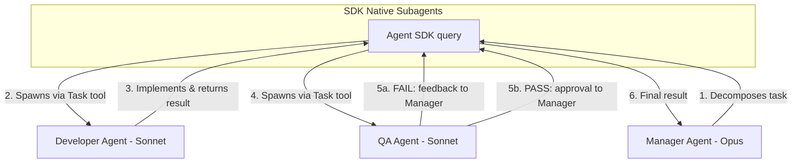
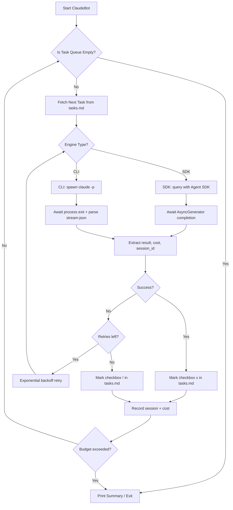
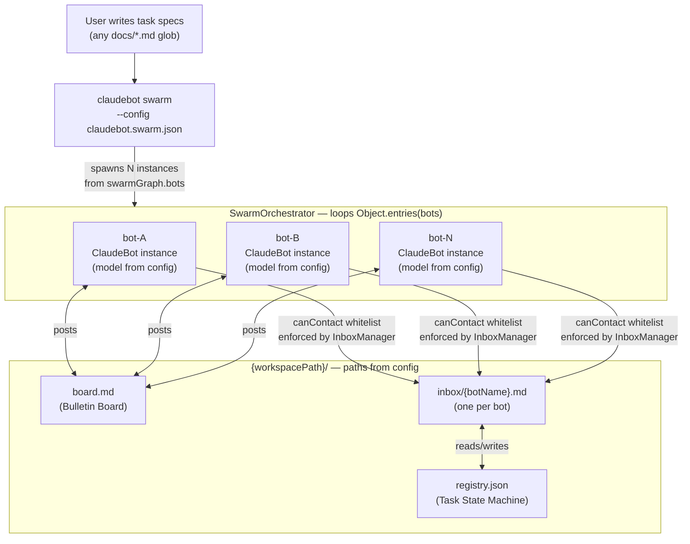

# Product Requirements Document (PRD): ClaudeBot

## 1. Product Vision

**"Stop just chatting with AI, and start delegating."**

ClaudeBot is an autonomous, queue-driven orchestrator that transforms Claude from a conversational assistant into a proactive, goal-driven agent working continuously in the background.

**Hybrid Architecture:** Agent SDK (primary) + CLI wrapping (fallback)

- **Agent SDK Engine** (`@anthropic-ai/claude-agent-sdk`): Type-safe, native subagent support, exact cost tracking. Requires API Key.
- **CLI Engine** (`claude -p --output-format stream-json`): Works with Max subscription billing. Simpler but less reliable.

## 2. Objectives & Success Metrics

* **Primary Goal:** Automate repetitive coding, refactoring, and testing tasks without manual prompt intervention.
* **Milestone:** Achieve **5,000 GitHub Stars** to secure the Claude MAX 5-month reward.
* **Success Metric:** Zero downtime between tasks. The bot successfully empties a predefined task queue with 100% autonomy.

## 3. Target Audience

* Developers tired of babysitting AI prompts.
* Teams needing massive, multi-file refactoring or automated overnight testing.
* Open-source contributors looking for hands-free boilerplate generation.

## 4. Core Features

* **Task Queue Management:** Reads tasks from a markdown file (`tasks.md` with checkboxes) and executes them sequentially. Supports inline tags: `[cwd:path]`, `[budget:1.50]`, `[turns:30]`, `[agent:name]`.
* **Hybrid Execution Engine:** Abstract `IExecutor` interface with two implementations:
  - **SDK Executor:** Uses `query()` from `@anthropic-ai/claude-agent-sdk` for type-safe, streaming execution with native subagent support.
  - **CLI Executor:** Uses `claude -p --output-format stream-json` as a child process for Max subscription users.
* **Automatic Completion Detection:** SDK engine returns when `query()` completes. CLI engine detects completion via process exit code + `type: "result"` in stream-json output.
* **Resilient Execution:** Exponential backoff retry, per-task AbortController timeouts, graceful SIGINT/SIGTERM shutdown.
* **Cost Tracking:** SDK provides exact `total_cost_usd`. CLI provides estimated cost. Global budget limits halt the queue when exceeded.
* **Session Management:** Persists session IDs to `.claudebot/sessions.json` for resume capability and historical cost tracking.

## 5. Advanced Feature: Multi-Agent Swarm

ClaudeBot supports a Manager/Developer/QA pipeline using the Agent SDK's **native `agents` option**. No external message broker (Redis, SQLite) is needed.

* **Role-Based Agents:** Manager (Opus), Developer (Sonnet), QA (Sonnet) with distinct tool permissions.
* **Task Delegation:** Manager uses the SDK's `Task` tool to spawn Developer and QA subagents automatically.
* **Peer Review Loop:** Developer submits code, QA validates. If QA fails, Manager routes feedback back to Developer (capped at 3 revision cycles).
* **Tool Isolation:** QA has read-only access (no Write/Edit tools), preventing unauthorized modifications.

## 6. Multi-Agent Architecture

The swarm uses SDK-native subagents - no custom IPC required.



## 7. System Architecture

The core engine uses a simple sequential loop. The `IExecutor` abstraction enables switching between SDK and CLI backends.



## 8. Technology Stack

| Component | Technology |
|-----------|-----------|
| Language | TypeScript (ESM, ES2022) |
| Primary Engine | `@anthropic-ai/claude-agent-sdk` |
| Fallback Engine | `claude` CLI (`-p --output-format stream-json`) |
| CLI Framework | Commander.js |
| Logging | Pino |
| Config Validation | Zod |
| Permission Mode | `acceptEdits` (default) |

## 9. Cost Model

| Engine | Billing | Cost Tracking |
|--------|---------|--------------|
| SDK | API Key (per-token) | Exact: `SDKResultMessage.total_cost_usd` |
| CLI | Max subscription (flat rate) | Estimated from usage data or N/A |

**Budget Controls:**
- `maxBudgetPerTaskUsd`: Per-task spending limit
- `maxTotalBudgetUsd`: Global budget for entire queue run
- Queue halts automatically when budget is exceeded

---

## 10. BotGraph — Generalized Multi-Bot Collaborative Pipeline

> **Status:** Planned Feature (Phase 2)
> Designed 2026-02-28. A config-driven, domain-agnostic framework for N-bot autonomous pipelines.

### 10.1 Vision & Motivation

The current ClaudeBot runs tasks sequentially with a single orchestrator. The next evolution is a **BotGraph**: a configurable team of named bots, each with a declared role, tool permissions, and peer connections — collaborating via a shared file workspace until a task backlog is exhausted.

**Core principle:** The framework is domain-agnostic. The same runtime supports a software dev team, a research team, a content pipeline, or any other collaborative workflow — purely by changing `claudebot.swarm.json`. No code changes between use cases.

**Core idea:** N named Claude instances run as independent ClaudeBot processes in watch mode. They communicate via two file-based channels: a shared bulletin board (`board.md`) and per-bot inboxes. No external message broker (Redis, RabbitMQ) needed — file I/O is the message bus.

**Relation to the existing SDK swarm:** The SDK-native swarm (Section 5) runs within a single `query()` call — top-down, ephemeral, no inter-process state. BotGraph runs across multiple processes with persistent state. They are complementary: a BotGraph bot can internally use an SDK swarm for complex subtasks.

---

### 10.2 BotGraph Config Schema (`claudebot.swarm.json`)

All bot roles, connections, and behavior are declared in a single config file. The framework reads this and spawns the appropriate processes — no hardcoded bot names anywhere in the code.

```jsonc
{
  "engine": "sdk",
  "permissionMode": "acceptEdits",
  "maxTotalBudgetUsd": 50.00,
  "watchIntervalMs": 15000,

  "swarmGraph": {
    // Shared workspace path (configurable, not hardcoded)
    "workspacePath": ".botspace",
    "boardFile": "board.md",
    "registryFile": "registry.json",
    "stuckTaskTimeoutMs": 600000,

    // Which bots start the pipeline on launch (others wake on inbox message)
    "entryBots": ["coordinator"],

    // N bots — any names, any roles
    "bots": {
      "coordinator": {
        "model": "claude-opus-4-6",
        "systemPromptFile": "prompts/coordinator.md",  // or inline "systemPrompt"
        "watchesFiles": ["docs/tasks/*.md"],            // this bot's trigger files (glob)
        "canContact": ["worker", "reviewer"],           // whitelist — enforced by orchestrator
        "workspaceDir": "coordinator",                  // under workspacePath
        "maxBudgetPerTaskUsd": 5.00,
        "maxTurnsPerTask": 30,
        "terminatesOnEmpty": true,                      // posts SWARM_COMPLETE when done
        "allowedTools": ["Read", "Write", "Edit", "Grep", "Glob"]
      },
      "worker": {
        "model": "claude-sonnet-4-6",
        "systemPromptFile": "prompts/worker.md",
        "watchesFiles": [],                             // wakes only on inbox messages
        "canContact": ["coordinator", "reviewer"],
        "workspaceDir": "worker",
        "maxBudgetPerTaskUsd": 10.00,
        "maxTurnsPerTask": 60,
        "terminatesOnEmpty": false,
        "allowedTools": ["Read", "Write", "Edit", "Grep", "Glob", "Bash"]
      },
      "reviewer": {
        "model": "claude-sonnet-4-6",
        "systemPromptFile": "prompts/reviewer.md",
        "watchesFiles": [],
        "canContact": ["coordinator", "worker"],
        "workspaceDir": "reviewer",
        "maxBudgetPerTaskUsd": 3.00,
        "maxTurnsPerTask": 20,
        "terminatesOnEmpty": false,
        "allowedTools": ["Read", "Grep", "Glob", "Bash"]  // no Write/Edit = read-only
      }
    },

    "message": {
      "routingStrategy": "explicit",   // canContact enforced; LLM picks recipient from whitelist
      "format": "envelope",
      "maxRoutingCycles": 3            // max rework cycles before escalating to failed
    },
    "termination": {
      "gracePeriodMs": 30000
    }
  }
}
```

**Key config fields replacing all hardcoded PRD concepts:**

| OLD (hardcoded) | NEW (config field) |
| --- | --- |
| Fixed bot names | `bots: Record<string, BotDefinition>` — any string key |
| `.botspace/` path | `swarmGraph.workspacePath` |
| `bot-pd` hardcoded as entry | `entryBots: string[]` — any bot(s) |
| `bot-pd` hardcoded as terminator | `terminatesOnEmpty: boolean` per-bot |
| Implicit `canContact` | `canContact: string[]` whitelist per bot |
| Typed message enum | Free-form `subject` string in envelope |
| `docs/task*.md` hardcoded for `bot-pd` | `watchesFiles: string[]` glob per bot |
| System prompts in `bot-configs.ts` | `systemPrompt` inline or `systemPromptFile` path |

---

### 10.3 Generic Message Envelope

All inter-bot messages use a single envelope format written to each bot's inbox as markdown checkboxes — parsed by the **existing `parseTasks` regex with zero code changes**:

```markdown
# .botspace/inbox/worker.md

- [ ] MSG-042 | from:coordinator | to:worker | subject:ASSIGN | taskId:task-001 | See docs/tasks/task-001.md
- [ ] MSG-043 | from:reviewer | to:worker | subject:REWORK | taskId:task-001 | See .botspace/reviewer/task-001-r1.md
- [x] MSG-041 | from:coordinator | to:worker | subject:ASSIGN | taskId:task-000 | Initial impl task
```

| Field | Type | Description |
| --- | --- | --- |
| `MSG-NNN` | auto-increment | Unique message ID |
| `from` | bot name | Sender (validated against `canContact`) |
| `to` | bot name | Recipient |
| `subject` | free string | Semantic label — **no enum**, domain-defined in prompts |
| `taskId` | string? | Optional registry reference |
| trailing text | free string | Human-readable context or file paths |

**`subject` is free-form:** `ASSIGN`, `REWORK`, `QUESTION`, `COPY_READY`, `TESTS_FAILED` — the vocabulary is defined in `prompts/*.md` files, not in code. Changing the workflow vocabulary requires only prompt edits.

**Inbox as task queue:** Each bot's ClaudeBot instance uses its inbox file as its `tasksFile`. Unread messages (`[ ]`) are tasks. Processed messages become `[x]`. The existing `parseTasks` + `updateTaskInFile` machinery handles this automatically.

---

### 10.4 Communication Channels

Two channels operate simultaneously:

#### Channel A: Shared Bulletin Board — `{workspacePath}/board.md`

A **public, append-only** markdown log visible to all bots. Every significant action is posted here for audit trail and broadcast.

```markdown
## 2026-02-28T14:00:00Z | coordinator | ASSIGN
Delegating task-001 "Implement JWT auth" to worker.

## 2026-02-28T14:22:10Z | worker | QUESTION
@coordinator: Should JWT use RS256 or HS256?

## 2026-02-28T14:23:00Z | coordinator | ANSWER
@worker: Use RS256. See config/security.md.

## 2026-02-28T15:46:00Z | coordinator | COMPLETE
task-001 marked [x]. Picking up task-002.
```

#### Channel B: Direct Inbox — `{workspacePath}/inbox/{botName}.md`

Per-bot inbox file (see envelope format above). The orchestrator enforces `canContact` before writing — messages to unauthorized bots are rejected and logged to `board.md`.

---

### 10.5 Task State Machine

Generic states tracked in `{workspacePath}/registry.json` — state names are the same regardless of bot names or domain:

```text
pending ──► assigned ──► in_progress ──► reviewing ──► done
                │              │               │
                │           paused ────────────┘  (waiting for clarification)
                │                               │
                └───────────────────────────────► failed
                        (maxRoutingCycles exceeded)
```

| State | Set By | Trigger |
| --- | --- | --- |
| `pending` | entry bot | Task found in `watchesFiles` |
| `assigned` | entry bot | Task message sent to worker |
| `in_progress` | worker | Worker acknowledges task |
| `paused` | worker | Worker sends QUESTION to coordinator |
| `reviewing` | worker | Worker sends READY_FOR_REVIEW to reviewer |
| `done` | reviewer | Reviewer sends APPROVED to coordinator |
| `failed` | reviewer / coordinator | `maxRoutingCycles` exceeded |

State names are generic — workflows use the same states regardless of domain (software, research, data, content).

---

### 10.6 Workspace File Structure

Workspace layout derives from config — no hardcoded paths:

```text
{workspacePath}/                  # Configurable via swarmGraph.workspacePath
├── board.md                      # Shared bulletin board (append-only)
├── registry.json                 # Canonical task state machine
├── inbox/
│   ├── {botName-1}.md            # Direct messages TO botName-1
│   ├── {botName-2}.md            # Direct messages TO botName-2
│   └── {botName-N}.md            # One inbox per bot declared in config
└── {botName}/                    # Per-bot workspace (one dir per bot)
    └── sessions.json             # Per-bot cost/session history
```

Prompt files live outside `workspacePath` in user-defined locations:

```text
prompts/
├── coordinator.md                # System prompt for coordinator bot
├── worker.md                     # System prompt for worker bot
└── reviewer.md                   # System prompt for reviewer bot
```

---

### 10.7 New Components (`src/swarm/`)

All components are fully generic — **zero hardcoded bot names** anywhere:

| File | Description |
| --- | --- |
| `types.ts` | `BotDefinition`, `SwarmGraphConfig` (Zod schemas), `BotMessage`, `RegistryEntry` |
| `config-loader.ts` | `loadSwarmConfig()` — validates `claudebot.swarm.json` |
| `bot-factory.ts` | `buildBotConfig(botName, def, root)` → `ClaudeBotConfig` — derives per-bot config from `BotDefinition` |
| `orchestrator.ts` | `SwarmOrchestrator` — loops `Object.entries(config.swarmGraph.bots)`, spawns N `ClaudeBot` instances |
| `inbox.ts` | `InboxManager` — writes/reads inbox files, enforces `canContact` whitelist |
| `board.ts` | `BulletinBoard` — appends timestamped entries to `board.md` |
| `registry.ts` | `RegistryManager` — atomic read/write of `registry.json` |
| `workspace.ts` | `bootstrapWorkspace()` — creates dirs from config on first run |

**Existing components unchanged:** `ClaudeBot`, `parseTasks`, `updateTaskInFile`, `SdkExecutor`, `SessionManager`. Bot differentiation comes entirely from `systemPromptPrefix` + `allowedTools` + `tasksFile` — all derived from `BotDefinition` in `bot-factory.ts`.

**Orchestrator core (generic, no hardcoded names):**

```typescript
// src/swarm/orchestrator.ts
const instances = Object.entries(config.swarmGraph.bots).map(([name, def]) => ({
  name,
  bot: new ClaudeBot(buildBotConfig(name, def, config), logger),
}));
await Promise.all(instances.map(({ bot }) => bot.run()));
```

---

### 10.8 Multiple Team Configurations (Same Runtime, Different Config)

The same `SwarmOrchestrator` code runs all of these with zero changes — only `claudebot.swarm.json` differs:

| Team Type | Entry Bot | Bots | `watchesFiles` | `terminatesOnEmpty` |
| --- | --- | --- | --- | --- |
| Software Dev | `coordinator` | coordinator, worker, reviewer | `docs/tasks/*.md` | coordinator |
| Research | `lead` | lead, researcher, writer, editor | `docs/briefs/*.md` | lead |
| Data Pipeline | `planner` | planner, coder, tester | `docs/pipelines/*.md` | planner |
| Content Marketing | `strategist` | strategist, copywriter, seo | `docs/requests/*.md` | strategist |

**The PD/Dev/QA scenario from the original design is expressed as:**
`coordinator` (Opus, `terminatesOnEmpty: true`, `watchesFiles: ["docs/task*.md"]`) + `worker` (Sonnet, full tools) + `reviewer` (Sonnet, read-only tools). Identical behavior, generic names.

---

### 10.9 Architecture Diagram



---

### 10.10 Design Decisions

**Why free-form `subject` instead of a typed enum?**
An enum (`TASK_ASSIGNMENT`, `IMPL_COMPLETE`, etc.) belongs to a specific domain and breaks immediately for other workflows (`COPY_READY`, `TESTS_FAILED`, `RESEARCH_DONE`). The orchestrator never interprets `subject` — it only routes the envelope. Subject semantics live in `prompts/*.md`, allowing vocabulary changes with zero code edits.

**Why `canContact` whitelist (explicit routing) instead of emergent LLM routing?**
Explicit edges are auditable (all routing decisions logged in `board.md`), prevent silent failures, and stop bots from forming cycles not anticipated in the design. The LLM still decides *when* to message a contact and *which* permitted contact to choose — it just cannot route outside its declared whitelist.

**Why multi-process instead of SDK-native swarm?**
SDK swarm runs within one `query()` call: top-down only, no lateral communication, state lost between runs. BotGraph requires bidirectional messaging (worker → coordinator for clarifications), multi-task lifecycle tracking, and state that survives restarts. Use SDK swarm for single complex task decomposition; use BotGraph for persistent multi-task pipelines.

**Concurrency and file safety:**
N bots may write to `registry.json` concurrently. Mitigation: a `.registry.lock` sentinel file with a timeout prevents concurrent overwrites. `board.md` is append-only — concurrent appends produce interleaved lines at worst, but no data corruption.

**Loop termination:**
The bot with `terminatesOnEmpty: true` monitors its `watchesFiles`. When all tasks are `done`/`failed` in the registry and no unchecked tasks remain, it posts `SWARM_COMPLETE` to `board.md`. The orchestrator monitors for this signal and calls `bot.abort()` on all instances after `gracePeriodMs`.

---

### 10.11 Implementation Roadmap

| Phase | Deliverable | Priority |
| --- | --- | --- |
| Phase 2.1 | `src/swarm/types.ts` — Zod schemas for `BotDefinition`, `SwarmGraphConfig`, `BotMessage`, `RegistryEntry` | High |
| Phase 2.2 | `src/swarm/config-loader.ts` + `bot-factory.ts` — config validation and per-bot config derivation | High |
| Phase 2.3 | `src/swarm/inbox.ts` + `board.ts` + `registry.ts` + `workspace.ts` — communication data layer | High |
| Phase 2.4 | `src/swarm/orchestrator.ts` — generic N-bot spawner with termination detection | High |
| Phase 2.5 | `claudebot swarm` CLI command in `src/index.ts` | Medium |
| Phase 2.6 | Example `claudebot.swarm.json` + `prompts/` for software dev team | Medium |
| Phase 2.7 | Deadlock detection + stuck-task watchdog in orchestrator | Low |
| Phase 2.8 | Cross-bot cost aggregation in `claudebot status --swarm` | Low |
