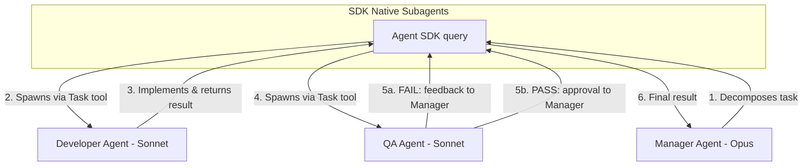
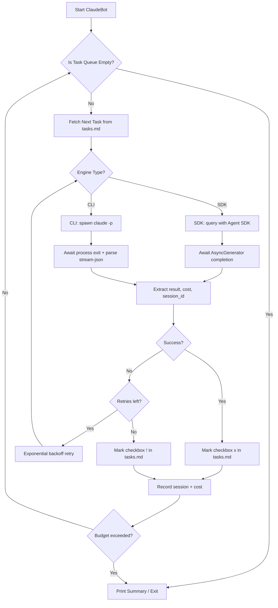
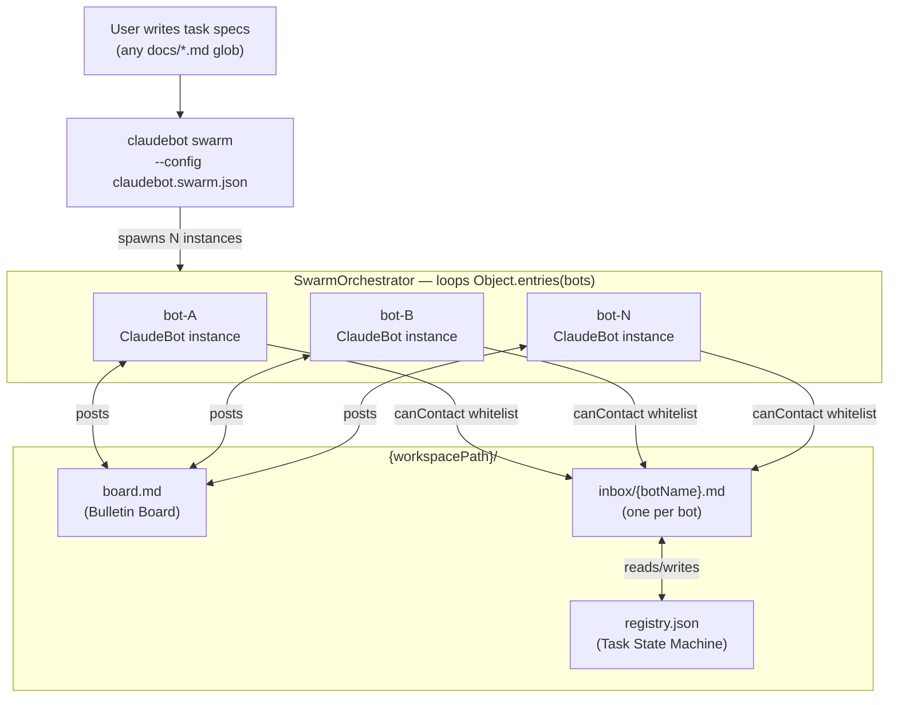

# 제품 요구사항 문서 (PRD): ClaudeBot

## 1. 제품 비전

> "AI와 대화만 하지 말고, 실제로 위임하세요."

ClaudeBot은 자율적인 큐 기반 오케스트레이터로, Claude를 단순한 대화형 보조 도구에서 백그라운드에서 지속적으로 목표를 향해 움직이는 능동적인 에이전트로 변환합니다.

**하이브리드 아키텍처:** Agent SDK (기본) + CLI 래핑 (폴백)

- **Agent SDK 엔진** (`@anthropic-ai/claude-agent-sdk`): 타입 안전성, 네이티브 서브에이전트 지원, 정확한 비용 추적. API Key 필요.
- **CLI 엔진** (`claude -p --output-format stream-json`): Max 구독 청구 방식에서 동작. 더 단순하지만 신뢰성은 낮음.

### 1.1 경쟁 차별점

| 경쟁 도구 | 접근 방식 | ClaudeBot 차별점 |
|-----------|----------|-----------------|
| CrewAI | Python 기반, YAML 선언 | TypeScript/Node.js 네이티브, 마크다운 기반 |
| AutoGen | Python, 복잡한 API | 파일 기반 통신, 외부 인프라(Redis 등) 불필요 |
| MetaGPT | 고정 SOP 역할 체계 | 동적 봇 생성 + 사용자 승인 HITL 워크플로우 |
| Cursor/Windsurf | IDE 통합형 | 독립 실행형 CLI, 하이브리드 엔진(SDK/CLI) |
| Devin | 단일 에이전트 루프 | 멀티 에이전트 파이프라인, 투명한 파일 기반 감사 추적 |

**ClaudeBot만의 고유 강점:**
- **제로 인프라**: Redis, RabbitMQ 없이 파일 I/O만으로 봇 간 통신
- **하이브리드 엔진**: API Key(SDK) 또는 Max 구독(CLI) 선택 가능
- **체계적 온보딩**: 한 줄 입력이 아닌 브레인스토밍 기반 목표 설정
- **PoC 통합**: 기술 검증을 개발 전에 자동화

## 2. 목표 및 성공 지표

* **주요 목표:** 수동 프롬프트 개입 없이 반복적인 코딩, 리팩터링, 테스트 작업을 자동화한다.
* **마일스톤:** Claude MAX 5개월 보상을 받기 위해 **GitHub Stars 5,000개** 달성.
* **성공 지표:** 작업 간 다운타임 제로. 봇이 사전에 정의된 작업 큐를 100% 자율적으로 완전히 처리한다.

## 3. 대상 사용자

| 페르소나 | 설명 | 핵심 니즈 | 주요 사용 기능 |
|----------|------|----------|---------------|
| **솔로 개발자** | 개인 프로젝트에서 반복 작업 자동화를 원하는 개발자 | 간단한 CLI, 저비용 | Phase 1 작업 큐, TUI 모니터링 |
| **테크 리더** | 팀의 야간 자동화 파이프라인을 관리하는 리드 | 실시간 모니터링, 비용 관리 | Dashboard, 비용 대시보드 |
| **AI 파워 유저** | 복잡한 멀티봇 워크플로우를 설계하고 실행하는 개발자 | 동적 봇 구성, 자동 온보딩 | Orchestrator, 4-Step Workflow |

## 4. Phase 구조

```
Phase 1 (완료): 단일 봇 순차 작업 큐 실행
Phase 2 (완료): BotGraph — 정적 config 기반 N봇 협업
Phase 3: Dashboard — 봇 상태 모니터링 + 세션 시각화
Phase 4: Orchestrator — 동적 봇 생성 + 4-Step Workflow
Phase 5: Dashboard v2 — 대화형 인터페이스 + 결과 보고서
```

> Phase 2(BotGraph)가 Phase 3 이후 모든 기능의 인프라 기반이다. BotGraph의 `SwarmOrchestrator`, `InboxManager`, `RegistryManager`가 안정적으로 동작해야 Phase 3 이후 진행이 가능하다.

---

## 5. 핵심 기능 (Phase 1 — ✅ 완료)

* **작업 큐 관리:** 마크다운 파일(`tasks.md`의 체크박스)에서 작업을 읽어 순차적으로 실행한다. 인라인 태그 지원: `[cwd:path]`, `[budget:1.50]`, `[turns:30]`, `[agent:name]`.
* **하이브리드 실행 엔진:** 두 가지 구현체를 가진 추상 `IExecutor` 인터페이스:
  - **SDK Executor:** 타입 안전 스트리밍 실행과 네이티브 서브에이전트 지원을 위해 `@anthropic-ai/claude-agent-sdk`의 `query()`를 사용.
  - **CLI Executor:** Max 구독 사용자를 위해 `claude -p --output-format stream-json`을 자식 프로세스로 실행.
* **자동 완료 감지:** SDK 엔진은 `query()` 완료 시 반환. CLI 엔진은 프로세스 종료 코드 + stream-json 출력의 `type: "result"`로 완료를 감지.
* **안정적인 실행:** 지수 백오프 재시도, 작업별 AbortController 타임아웃, SIGINT/SIGTERM 우아한 종료 처리.
* **비용 추적:** SDK는 `total_cost_usd`를 정확하게 제공. CLI는 추정 비용을 제공. 전역 예산 한도를 초과하면 큐를 자동으로 중단.
* **세션 관리:** 재개 기능 및 히스토리 비용 추적을 위해 세션 ID를 `.claudebot/sessions.json`에 저장.

## 6. 고급 기능: 멀티 에이전트 스웜

ClaudeBot은 Agent SDK의 **네이티브 `agents` 옵션**을 활용한 Manager/Developer/QA 파이프라인을 지원한다. Redis, SQLite 같은 외부 메시지 브로커는 필요 없다.

* **역할 기반 에이전트:** Manager (Opus), Developer (Sonnet), QA (Sonnet)가 각각 별도의 도구 권한을 가짐.
* **작업 위임:** Manager가 SDK의 `Task` 도구를 사용해 Developer와 QA 서브에이전트를 자동으로 생성.
* **피어 리뷰 루프:** Developer가 코드를 제출하면 QA가 검증. QA 실패 시, Manager가 피드백을 Developer에게 다시 전달 (최대 3회 수정 사이클).
* **도구 격리:** QA는 읽기 전용 접근권한을 가짐 (Write/Edit 도구 없음). 무단 수정을 방지.

## 7. 멀티 에이전트 아키텍처

스웜은 SDK 네이티브 서브에이전트를 사용하므로 별도의 IPC 구현이 필요 없다.



## 8. 시스템 아키텍처

핵심 엔진은 단순한 순차 루프를 사용한다. `IExecutor` 추상화를 통해 SDK와 CLI 백엔드를 전환할 수 있다.



## 9. 기술 스택

| 구성 요소 | 기술 |
|-----------|-----------|
| 언어 | TypeScript (ESM, ES2022) |
| 기본 엔진 | `@anthropic-ai/claude-agent-sdk` |
| 폴백 엔진 | `claude` CLI (`-p --output-format stream-json`) |
| CLI 프레임워크 | Commander.js |
| 로깅 | Pino |
| config 유효성 검사 | Zod |
| 권한 모드 | `acceptEdits` (기본값) |

## 10. 비용 모델

| 엔진 | 청구 방식 | 비용 추적 |
|--------|---------|--------------|
| SDK | API Key (토큰 단위) | 정확: `SDKResultMessage.total_cost_usd` |
| CLI | Max 구독 (정액제) | 사용량 데이터 기반 추정 또는 N/A |

**예산 제어:**

- `maxBudgetPerTaskUsd`: 작업당 지출 한도
- `maxTotalBudgetUsd`: 전체 큐 실행의 전역 예산
- 예산 초과 시 큐가 자동으로 중단됨

---

## 11. BotGraph — 범용 멀티 봇 협업 파이프라인 (Phase 2 — ✅ 완료)

> **상태:** ✅ 구현 완료 — `src/swarm/` 9개 파일, `claudebot swarm` CLI 명령어 추가
> 설계일: 2026-02-28. 구현일: 2026-03-01. N개 봇 자율 파이프라인을 위한 config 기반, 도메인 독립적 프레임워크.

### 11.1 비전 및 동기

현재 ClaudeBot은 단일 오케스트레이터로 작업을 순차 처리한다. 다음 진화 단계는 **BotGraph**로, 이름이 정의된 봇들이 각자의 역할, 도구 권한, 피어 연결을 선언하고 공유 파일 워크스페이스를 통해 협력하여 작업 백로그를 소진할 때까지 동작하는 구성 가능한 팀이다.

**핵심 원칙:** 프레임워크는 도메인에 독립적이다. 동일한 런타임이 소프트웨어 개발 팀, 연구 팀, 콘텐츠 파이프라인, 또는 어떤 협업 워크플로우도 지원한다 — `claudebot.swarm.json`을 바꾸는 것만으로 가능하며, 코드 변경은 필요 없다.

**핵심 아이디어:** N개의 이름이 붙은 Claude 인스턴스가 watch 모드로 독립적인 ClaudeBot 프로세스로 동작한다. 이들은 공유 게시판(`board.md`)과 봇별 inbox라는 두 개의 파일 기반 채널로 통신한다. 외부 메시지 브로커(Redis, RabbitMQ)는 필요 없다 — 파일 I/O가 메시지 버스 역할을 한다.

**기존 SDK 스웜과의 관계:** SDK 네이티브 스웜(6절)은 단일 `query()` 호출 내에서 동작한다 — 하향식, 일회성, 프로세스 간 상태 없음. BotGraph는 여러 프로세스에 걸쳐 영속 상태로 실행된다. 둘은 상호 보완적이다: BotGraph의 봇은 내부적으로 복잡한 서브태스크 처리를 위해 SDK 스웜을 활용할 수 있다.

---

### 11.2 BotGraph Config 스키마 (`claudebot.swarm.json`)

모든 봇 역할, 연결, 동작은 단일 config 파일에 선언된다. 프레임워크가 이를 읽어 적절한 프로세스를 생성한다 — 코드 어디에도 봇 이름이 하드코딩되지 않는다.

```jsonc
{
  "engine": "sdk",
  "permissionMode": "acceptEdits",
  "maxTotalBudgetUsd": 50.00,
  "watchIntervalMs": 15000,

  "swarmGraph": {
    "workspacePath": ".botspace",
    "boardFile": "board.md",
    "registryFile": "registry.json",
    "stuckTaskTimeoutMs": 600000,

    "entryBots": ["coordinator"],

    "bots": {
      "coordinator": {
        "model": "claude-opus-4-6",
        "systemPromptFile": "prompts/coordinator.md",
        "watchesFiles": ["docs/tasks/*.md"],
        "canContact": ["worker", "reviewer"],
        "workspaceDir": "coordinator",
        "maxBudgetPerTaskUsd": 5.00,
        "maxTurnsPerTask": 30,
        "terminatesOnEmpty": true,
        "allowedTools": ["Read", "Write", "Edit", "Grep", "Glob"]
      },
      "worker": {
        "model": "claude-sonnet-4-6",
        "systemPromptFile": "prompts/worker.md",
        "watchesFiles": [],
        "canContact": ["coordinator", "reviewer"],
        "workspaceDir": "worker",
        "maxBudgetPerTaskUsd": 10.00,
        "maxTurnsPerTask": 60,
        "terminatesOnEmpty": false,
        "allowedTools": ["Read", "Write", "Edit", "Grep", "Glob", "Bash"]
      },
      "reviewer": {
        "model": "claude-sonnet-4-6",
        "systemPromptFile": "prompts/reviewer.md",
        "watchesFiles": [],
        "canContact": ["coordinator", "worker"],
        "workspaceDir": "reviewer",
        "maxBudgetPerTaskUsd": 3.00,
        "maxTurnsPerTask": 20,
        "terminatesOnEmpty": false,
        "allowedTools": ["Read", "Grep", "Glob", "Bash"]
      }
    },

    "message": {
      "routingStrategy": "explicit",
      "format": "envelope",
      "maxRoutingCycles": 3
    },
    "termination": {
      "gracePeriodMs": 30000
    }
  }
}
```

**하드코딩된 개념을 대체하는 핵심 config 필드:**

| 기존 (하드코딩) | 변경 후 (config 필드) |
| --- | --- |
| 고정된 봇 이름 | `bots: Record<string, BotDefinition>` — 임의의 문자열 키 |
| `.botspace/` 경로 | `swarmGraph.workspacePath` |
| 진입점 하드코딩 | `entryBots: string[]` — 임의의 봇 지정 가능 |
| 종료자 하드코딩 | `terminatesOnEmpty: boolean` (봇별 설정) |
| 암묵적인 `canContact` | `canContact: string[]` (봇별 화이트리스트) |
| 타입이 정해진 메시지 열거형 | 봉투의 자유 형식 `subject` 문자열 |

---

### 11.3 범용 메시지 봉투 (Generic Message Envelope)

모든 봇 간 메시지는 각 봇의 inbox에 마크다운 체크박스로 작성되는 단일 봉투 형식을 사용한다 — **코드 변경 없이 기존 `parseTasks` 정규식으로 파싱된다:**

```markdown
# .botspace/inbox/worker.md

- [ ] MSG-042 | from:coordinator | to:worker | subject:ASSIGN | taskId:task-001 | See docs/tasks/task-001.md
- [ ] MSG-043 | from:reviewer | to:worker | subject:REWORK | taskId:task-001 | See .botspace/reviewer/task-001-r1.md
- [x] MSG-041 | from:coordinator | to:worker | subject:ASSIGN | taskId:task-000 | Initial impl task
```

| 필드 | 타입 | 설명 |
| --- | --- | --- |
| `MSG-NNN` | 자동 증가 | 고유 메시지 ID |
| `from` | 봇 이름 | 발신자 (`canContact` 대조 검증) |
| `to` | 봇 이름 | 수신자 |
| `subject` | 자유 문자열 | 의미 레이블 — **열거형 없음**, 프롬프트에서 도메인 정의 |
| `taskId` | string? | 선택적 registry 참조 |
| 뒤따르는 텍스트 | 자유 문자열 | 사람이 읽기 위한 컨텍스트 또는 파일 경로 |

---

### 11.4 통신 채널

#### 채널 A: 공유 게시판 — `{workspacePath}/board.md`

모든 봇이 볼 수 있는 **공개, 추가 전용** 마크다운 로그.

```markdown
## 2026-02-28T14:00:00Z | coordinator | ASSIGN
Delegating task-001 "Implement JWT auth" to worker.

## 2026-02-28T14:22:10Z | worker | QUESTION
@coordinator: Should JWT use RS256 or HS256?

## 2026-02-28T15:46:00Z | coordinator | COMPLETE
task-001 marked [x]. Picking up task-002.
```

#### 채널 B: 직접 inbox — `{workspacePath}/inbox/{botName}.md`

봇별 inbox 파일. 오케스트레이터는 쓰기 전에 `canContact`를 강제 적용한다.

---

### 11.5 작업 상태 머신

`{workspacePath}/registry.json`에서 추적:

```text
pending ──► assigned ──► in_progress ──► reviewing ──► done
                │              │               │
                │           paused ────────────┘
                │                               │
                └───────────────────────────────► failed
                        (maxRoutingCycles 초과)
```

| 상태 | 설정 주체 | 트리거 |
| --- | --- | --- |
| `pending` | entry bot | `watchesFiles`에서 작업 발견 |
| `assigned` | entry bot | worker에게 작업 메시지 전송 |
| `in_progress` | worker | worker가 작업 수락 확인 |
| `paused` | worker | worker가 coordinator에게 QUESTION 전송 |
| `reviewing` | worker | worker가 reviewer에게 READY_FOR_REVIEW 전송 |
| `done` | reviewer | reviewer가 coordinator에게 APPROVED 전송 |
| `failed` | coordinator | `maxRoutingCycles` 초과 |

---

### 11.6 워크스페이스 파일 구조

```text
{workspacePath}/
├── board.md
├── registry.json
├── inbox/
│   ├── {botName-1}.md
│   ├── {botName-2}.md
│   └── {botName-N}.md
└── {botName}/
    └── sessions.json
```

---

### 11.7 새로운 컴포넌트 (`src/swarm/`)

| 파일 | 설명 |
| --- | --- |
| `types.ts` | `BotDefinition`, `SwarmGraphConfig` (Zod 스키마), `BotMessage`, `RegistryEntry` |
| `config-loader.ts` | `loadSwarmConfig()` — `claudebot.swarm.json` 유효성 검사 |
| `bot-factory.ts` | `buildBotConfig(botName, def, root)` → `ClaudeBotConfig` |
| `orchestrator.ts` | `SwarmOrchestrator` — N개의 `ClaudeBot` 인스턴스 생성 |
| `inbox.ts` | `InboxManager` — inbox 파일 읽기/쓰기, `canContact` 강제 |
| `board.ts` | `BulletinBoard` — `board.md`에 타임스탬프 항목 추가 |
| `registry.ts` | `RegistryManager` — `registry.json` 원자적 읽기/쓰기 |
| `workspace.ts` | `bootstrapWorkspace()` — config 기반 디렉터리 생성 |

---

### 11.8 다양한 팀 구성

동일한 `SwarmOrchestrator` 코드가 코드 변경 없이 아래 모든 구성을 실행한다:

| 팀 유형 | 진입 봇 | 봇 구성 | `watchesFiles` | `terminatesOnEmpty` |
| --- | --- | --- | --- | --- |
| 소프트웨어 개발 | `coordinator` | coordinator, worker, reviewer | `docs/tasks/*.md` | coordinator |
| 연구 | `lead` | lead, researcher, writer, editor | `docs/briefs/*.md` | lead |
| 데이터 파이프라인 | `planner` | planner, coder, tester | `docs/pipelines/*.md` | planner |
| 콘텐츠 마케팅 | `strategist` | strategist, copywriter, seo | `docs/requests/*.md` | strategist |

---

### 11.9 아키텍처 다이어그램



---

### 11.10 설계 결정 사항

**왜 자유 형식 `subject`를 사용하는가?**
열거형은 특정 도메인에 종속된다. 오케스트레이터는 `subject`를 해석하지 않는다 — 봉투를 라우팅할 뿐이다. subject의 의미는 `prompts/*.md`에 있으며, 코드 수정 없이 어휘를 바꿀 수 있다.

**왜 `canContact` 화이트리스트를 사용하는가?**
명시적 엣지는 감사 가능하고, 조용한 실패를 방지하며, 예측하지 못한 사이클을 막는다. LLM은 여전히 허가된 연락처 중 누구를 선택할지 결정한다.

**왜 멀티 프로세스를 사용하는가?**
SDK 스웜은 단일 `query()` 내에서만 동작한다. BotGraph는 양방향 메시징, 멀티 작업 수명주기, 재시작 후 상태 유지를 필요로 한다.

**동시성:** `.registry.lock` 센티넬 파일이 동시 덮어쓰기를 방지한다. `board.md`는 추가 전용.

**루프 종료:** `terminatesOnEmpty: true` 봇이 `SWARM_COMPLETE`를 게시하면 오케스트레이터가 `gracePeriodMs` 후 모든 인스턴스에 `abort()`를 호출한다.

---

### 11.11 구현 로드맵

| 단계 | 산출물 | 상태 |
| --- | --- | --- |
| Phase 2.1 | `src/swarm/types.ts` — Zod 스키마 | ✅ 완료 |
| Phase 2.2 | `config-loader.ts` + `bot-factory.ts` | ✅ 완료 |
| Phase 2.3 | `inbox.ts` + `board.ts` + `registry.ts` + `workspace.ts` | ✅ 완료 |
| Phase 2.4 | `orchestrator.ts` — N봇 스포너 | ✅ 완료 |
| Phase 2.5 | `claudebot swarm` CLI 명령어 | ✅ 완료 |
| Phase 2.6 | 예시 `claudebot.swarm.json` + `prompts/` | ✅ 완료 |
| Phase 2.7 | 데드락 감지 + stuck-task 감시 | 계획 |
| Phase 2.8 | `claudebot status --swarm` 봇 간 비용 집계 | 계획 |

---

## 12. Dashboard — 봇 상태 모니터링 (Phase 3)

### 12.1 사용자 스토리

- "개발자로서, 3개의 봇이 병렬 작업 중일 때 각 봇의 진행 상태를 한 화면에서 실시간으로 확인하고 싶다."
- "테크 리더로서, 야간 자동 실행 중인 봇들의 총 비용과 남은 예산을 확인하고 싶다."
- "개발자로서, 특정 봇에서 에러가 발생했을 때 해당 봇의 로그와 컨텍스트를 즉시 확인하고 싶다."

### 12.2 기술 전략

| 단계 | 기술 | 적합한 시점 |
|------|------|------------|
| **v1 (✅ 구현 완료)** | React + Vite + Fastify + SSE | Phase 1 완료 직후 |
| **v2 TUI** | `ink` (React for Terminal) | BotGraph 안정화 후 |
| **v3 Web** | React + WebSocket (v1 확장) | Phase 5 |

> Dashboard v1은 `dashboard/` 디렉토리에 self-contained 웹 앱으로 구현됨.
> 6개 페이지: Dashboard, Sessions, Tasks, Analytics, Config, ProjectSelect.

### 12.3 Dashboard 레이아웃 (데스크탑)

```
+================================================================+
| HEADER: [프로젝트 경로] [연결 상태 ●]                            |
+================================================================+
| SIDEBAR (200px) | MAIN CONTENT (1fr)                           |
| ┌──────────┐    | ┌──────────────────────────────────────────┐ |
| │ Dashboard │    | │                                          │ |
| │ Sessions  │    | │  (현재 페이지 내용)                       │ |
| │ Tasks     │    | │                                          │ |
| │ Analytics │    | │                                          │ |
| │ Config    │    | │                                          │ |
| │ ───────── │    | │                                          │ |
| │ [Project] │    | │                                          │ |
| └──────────┘    | └──────────────────────────────────────────┘ |
+================================================================+
```

### 12.4 확장 Dashboard (Phase 5 — N봇 모니터링)

```
+==============================================================================+
| [ClaudeBot]  Project: my-app  |  Tasks: 12/20  |  Cost: $3.42/$50  |  [Gear]|
|  Bots: 3 active / 5 total    |  Queue: 4 msgs |  Uptime: 2h 14m   |        |
+==============================================================================+
|          |                                           |                       |
| BOT LIST |  CONVERSATION TIMELINE                    |  CONTEXT PANEL        |
| ======== |  ======================                   |  =============        |
|          |                                           |  [Tabs]               |
| [Queue:4]|  +-- Thread: task-001 (JWT Auth) ------+  |  [Detail|Log|Queue]   |
| ________ |  | [Orch] 14:00                         |  |                       |
|          |  | worker에게 JWT 인증 구현을            |  |  Bot: worker          |
| WORKING  |  | 위임합니다.                           |  |  Status: WORKING      |
| +------+ |  |                                      |  |  Task: task-001       |
| |worker| |  | [Worker] 14:22                       |  |  Model: sonnet        |
| |task-  | |  | RS256 vs HS256 어떤 것을             |  |  Cost: $1.23          |
| |001   | |  | 사용할까요?                           |  |  Turns: 12/60         |
| |$1.23 | |  |                                      |  |                       |
| +------+ |  | [!] DECISION REQUIRED      [Urgent] |  |  --- Session Log ---  |
|          |  | +----------------------------------+ |  |  14:00 Task assigned  |
| WAITING  |  | | JWT 암호화 방식을 결정해           | |  |  14:01 Reading specs  |
| +------+ |  | | 주세요.                            | |  |  14:15 Impl started   |
| |review| |  | |                                   | |  |  14:22 Question sent  |
| |idle  | |  | | [RS256] [HS256] [More Info]       | |  |                       |
| +------+ |  | +----------------------------------+ |  |                       |
|          |  |                                      |  |                       |
| DONE (2) |  | [Orch] 14:23                         |  |                       |
| task-000 |  | RS256을 사용하세요.                   |  |                       |
| task-003 |  +--------------------------------------+  |                       |
+==========+===========================================+=======================+
```

### 12.5 메시지 큐

| 요소 | 설계 |
|------|------|
| 우선순위 | 사용자 메시지 > 봇 메시지 (인메모리 `MinHeap` 큐) |
| 영속성 | 인메모리 큐 + 파일 inbox 이중 계층 (재시작 후 복구용) |
| 시각화 | Dashboard 좌측 상단에 큐 깊이 표시, Queue 탭에서 편집/삭제 |

### 12.6 UX 요구사항

| 범주 | 요구사항 |
|------|---------|
| **접근성** | WCAG 2.1 AA 준수, 색상 + 아이콘 병용, 키보드 네비게이션 |
| **다크 모드** | CSS custom properties 기반 테마, 기본값 다크 |
| **키보드 단축키** | `Ctrl+K` 커맨드 팔레트, `J/K` 항목 이동 |
| **검색/필터** | 대화 키워드 검색, 봇별/중요도별/시간대별 필터 |
| **반응형** | 1440px+ 풀 레이아웃 → 1024px 좌측 축소 → 768px 탭 전환 |
| **알림** | Critical: 모달+사운드, Important: 토스트, Info: 로그 영역 |

### 12.7 오류 상태 UI

| 오류 시나리오 | UI 표현 | 사용자 안내 |
|--------------|---------|------------|
| 봇 프로세스 크래시 | 봇 카드 빨간 강조 + 에러 배지 | "worker가 비정상 종료됨" |
| API 예산 초과 | 글로벌 바 경고 배너 | "예산 한도 도달" |
| 파일 락 충돌 | 로그에 경고 + 자동 재시도 | "5초 후 자동 재시도" |
| 메시지 라우팅 실패 | 대화에 인라인 경고 | "canContact 위반" |
| 봇 데드락 | 글로벌 바 경고 | "상호 대기 감지" |
| 도메인 이탈 감지 | Decision Card | "목표에서 벗어남. 계속/중단?" |

### 12.8 성공 지표

| 지표 | 목표 |
|------|------|
| 봇 상태 확인 소요 시간 | 터미널 로그 대비 80% 단축 |
| 에러 감지~대응 시간 | 5분 이내 |
| Dashboard 안정성 | N=10 봇 동시 모니터링 시 프레임 드롭 없음 |

---

## 13. Orchestrator — 동적 봇 생성 (Phase 4)

> BotGraph의 정적 config 방식을 대체하는 것이 아니라, BotGraph 위에 구축되는 AI 레이어다.

### 13.1 사용자 스토리

- "개발자로서, '로그인 기능 구현'이라는 목표만 제시하면 필요한 봇 구성이 자동으로 제안되길 원한다."
- "개발자로서, PoC가 필요한 기술적 난이도 높은 작업의 경우 본 개발 전에 기술 검증이 완료되었다는 확신을 가지고 싶다."
- "테크 리더로서, 봇이 목표에서 벗어나면 즉시 알림을 받고 작업을 중단시킬 수 있어야 한다."

### 13.2 Orchestrator 봇 설계

> 용어 표준화: "Bot-PD" → **"Orchestrator"** (글로벌 사용자 대상으로 보편적 용어 채택)

| 속성 | 설계 |
|------|------|
| 역할 | BotGraph의 `entryBot` + 동적 봇 생성 권한을 가진 특수 봇 |
| 사용자 인터페이스 | 사용자와 대화하는 유일한 봇 |
| BotGraph 관계 | `claudebot.swarm.json`의 특수 봇 타입 (`"type": "orchestrator"`) |
| 구현 방식 | `SwarmOrchestrator`에 `addBot(name, definition)` 런타임 API 추가 |

#### Orchestrator의 폴링 우선순위

```
1. 사용자 메시지 읽기 (최우선)
2. 대기 중인 작업 순차 처리
3. Sub-Bot 상태 확인 및 모니터링
```

#### Sub-Bot 생성 프로토콜

```typescript
interface BotProposal {
  name: string;                    // 예: "frontend-dev"
  role: string;                    // 예: "React 컴포넌트 개발"
  model: 'sonnet' | 'opus' | 'haiku';
  allowedTools: string[];          // 최소 권한
  canContact: string[];            // 통신 가능 대상
  maxBudgetPerTaskUsd: number;
  justification: string;          // 생성 근거
}
```

### 13.3 4-Step Workflow

#### Step 1: 목표 설정 온보딩

> 업계에서 거의 유일한 체계적 접근. "한 줄 입력 → 즉시 실행"이 주류인 경쟁 환경에서 차별화 포인트.

```
[사용자] → 프로젝트 목표 설명
              ↓
[Orchestrator] → 대화 기반 브레인스토밍
              ↓
         목표 명확화 + 요구사항 정리
              ↓
         기술 난이도 평가
              ↓
    ┌─────────┴─────────┐
    │                    │
  난이도 낮음         난이도 높음
    │                    │
    ↓                    ↓
  문서 생성          PoC 제안 → PoC 실행
    │                    │
    ↓                    ↓
  PRD-topic.md       PoC 결과 → TechSpec 반영
  TechSpec-topic.md      │
  Task-topic.md          ↓
    │              사용자에게 시작 알림
    ↓
  사용자 최종 승인
```

**온보딩 산출물:**
- `PRD-{topic}.md` — 프로젝트 요구사항
- `TechSpec-{topic}.md` — 기술 명세 (PoC 결과 포함)
- `Task-{topic}.md` — 실행할 작업 목록 (마크다운 체크박스)

**PoC 프로세스:**
- PoC는 무조건 구현이 아니라, 자료 수집 + 기술 타당성 검토가 병행
- PoC용 전담 Sub-Bot을 구성하여 진행
- 모든 PoC 결과가 명확해지면 TechSpec에 정리 후 사용자에게 알림
- 활용 가능한 도구: sub agent, context7 MCP, playwright MCP 등

#### Step 2: 최종 결과물 미리보기 (Output Preview)

> **핵심 혁신:** 코드를 작성하기 전에 최종 결과물의 모습을 미리 보여줌으로써, 사용자와 AI가 동일한 목표를 공유하고 있는지 확인한다. 이 단계는 Goal Drift(목표 표류)를 사전에 차단하는 가장 강력한 메커니즘이다.

```
[Orchestrator] → Task-topic.md + TechSpec-topic.md 분석
              ↓
         최종 결과물 예상 스냅샷 생성
              ↓
         Preview Report 표시
              ↓
[사용자] → 미리보기 확인 → 승인/수정/거부
```

**Output Preview Report 구성:**

```
+----------------------------------------------------------+
|  📋 Output Preview — JWT 인증 시스템                      |
+----------------------------------------------------------+
|                                                           |
|  ■ 예상 파일 구조:                                       |
|  src/                                                     |
|  ├── auth/                                                |
|  │   ├── jwt.service.ts          (신규)                   |
|  │   ├── jwt.middleware.ts       (신규)                   |
|  │   ├── auth.controller.ts      (신규)                   |
|  │   └── auth.types.ts           (신규)                   |
|  ├── routes/                                              |
|  │   └── auth.routes.ts          (신규)                   |
|  └── tests/                                               |
|      └── auth.test.ts            (신규)                   |
|  수정 예정: src/app.ts, src/middleware/index.ts           |
|                                                           |
|  ■ 예상 기능:                                            |
|  ✓ POST /api/auth/login — JWT 토큰 발급 (RS256)         |
|  ✓ POST /api/auth/refresh — 토큰 갱신                    |
|  ✓ GET /api/auth/me — 현재 사용자 정보                   |
|  ✓ 미들웨어: 보호된 라우트 접근 제어                     |
|                                                           |
|  ■ 예상 비용 및 시간:                                    |
|  총 작업: 8개 | 예상 비용: $8.00~$15.00                   |
|  예상 소요 턴: 20~35 turns                                |
|                                                           |
|  ■ 기술 결정 사항:                                       |
|  • 암호화: RS256 (비대칭키)                               |
|  • 토큰 만료: Access 15분, Refresh 7일                    |
|  • 저장소: 환경 변수로 키 관리                            |
|                                                           |
|  ■ 테스트 커버리지 예상:                                  |
|  • 유닛 테스트 4개 (서비스 + 미들웨어)                    |
|  • 통합 테스트 3개 (엔드포인트)                           |
|  • 엣지 케이스: 만료 토큰, 잘못된 서명, 미인증 접근      |
|                                                           |
|  [승인] [수정 요청] [처음부터 다시]                       |
+----------------------------------------------------------+
```

**미리보기 포함 항목:**

| 항목 | 설명 | 생성 소스 |
|------|------|----------|
| 예상 파일 구조 | 생성/수정될 파일 목록 및 디렉터리 트리 | TechSpec + Task 분석 |
| 예상 기능 | 구현될 API, 컴포넌트, 모듈의 동작 요약 | PRD 요구사항 |
| 예상 비용/시간 | 작업 수 × 평균 비용 기반 추정 | Task 목록 + 과거 세션 통계 |
| 기술 결정 사항 | 온보딩 중 결정된 기술 선택 요약 | TechSpec |
| 테스트 커버리지 | 검증 계획 및 예상 테스트 수 | Task 목록의 QA 항목 |
| 의존성 변경 | 추가/업데이트될 패키지 | TechSpec 의존성 섹션 |

**미리보기의 효과:**
- **Goal Drift 방지**: 실행 전 결과물 합의로 방향 이탈 사전 차단
- **비용 예측**: 예상 비용을 미리 확인하여 예산 초과 방지
- **사용자 신뢰**: "AI가 내 의도를 정확히 이해했다"는 확신 제공
- **수정 기회**: 잘못된 방향을 코드 작성 전에 수정 가능

#### Step 3: Sub-Bot 제안 및 승인

```
[Orchestrator] → Task-topic.md 분석
              ↓
         역할별 봇 구성 제안
         (각 봇의 이름, 역할, 모델, 도구, 예산, 근거)
              ↓
[Dashboard] → 제안 카드 표시
              ↓
[사용자] → 승인/수정/거부
              ↓
[Orchestrator] → BotGraph addBot() API로 봇 생성
```

**제안 형식 (Decision Card):**

```
+----------------------------------------------------------+
|  Bot Team Proposal                          [Review]      |
|                                                           |
|  목표: JWT 인증 시스템 구현                               |
|                                                           |
|  제안된 팀:                                               |
|  1. backend-dev (Sonnet) — JWT 인증 로직 구현            |
|     도구: Read, Write, Edit, Bash, Grep, Glob            |
|     예산: $5.00 / 작업                                    |
|                                                           |
|  2. frontend-dev (Sonnet) — 로그인 UI 구현               |
|     도구: Read, Write, Edit, Bash, Grep, Glob            |
|     예산: $5.00 / 작업                                    |
|                                                           |
|  3. qa-tester (Sonnet) — 통합 테스트 검증                |
|     도구: Read, Bash, Grep, Glob (읽기 전용)             |
|     예산: $3.00 / 작업                                    |
|                                                           |
|  총 예상 비용: $13.00~$20.00                              |
|                                                           |
|  [승인] [수정] [거부]                                     |
+----------------------------------------------------------+
```

#### Step 4: 작업 진행

```
개발 ──► 검증 ──► 안정성 확인 ──► 완료
  ↑         │
  └─ REWORK ┘  (최대 maxRoutingCycles 반복)
```

**작업 진행 규칙:**

| 규칙 | 설명 |
|------|------|
| 병렬 탐지 | Orchestrator가 수시로 병렬 가능 작업 식별 |
| 도메인 이탈 감지 | 목표 이탈 시 즉시 사용자 알림 |
| 작업 완료 판단 | Task-topic.md의 모든 체크박스 완료 시 알림 |
| 연속 작업 | 다음 작업 자동 진행 |
| 작업 추가 | 진행 중 필요 발견 시 Task-topic.md에 추가 |

### 13.4 BotGraph와의 관계

> Orchestrator는 BotGraph를 **대체하지 않고 확장**한다.

```
사용자
  ↓ (대화)
Orchestrator (특수 entryBot)
  ↓ (BotGraph API 호출)
SwarmOrchestrator.addBot(name, definition)
  ↓ (기존 BotGraph 인프라)
ClaudeBot 인스턴스 생성
  ↓
파일 기반 inbox/board 통신
```

**BotGraph 확장이 필요한 지점:**

| 컴포넌트 | 현재 (정적) | 확장 (동적) |
|----------|-----------|-----------|
| `SwarmOrchestrator` | 시작 시 N개 일괄 생성 | `addBot()` / `removeBot()` 런타임 API |
| `InboxManager` | 시작 시 inbox 일괄 생성 | 봇 추가 시 동적 등록 |
| `canContact` | 불변 화이트리스트 | 동적 확장 가능 |
| `parseTasks()` | 순서대로 처리 | 우선순위 정렬 지원 |
| `EventBus` | 없음 | `onBotCreated`, `onBotCompleted`, `onCostUpdate` |

### 13.5 성공 지표

| 지표 | 목표 |
|------|------|
| 수동 config 작성 대비 봇 구성 시간 | 70% 절감 |
| 온보딩에서 실행 시작까지 | 평균 15분 이내 |
| Orchestrator 봇 제안 승인율 | 80% 이상 |
| Output Preview 정확도 | 실제 결과 대비 80% 일치 |
| 도메인 이탈 감지 정확도 | 90% 이상 |

---

## 14. Dashboard v2 — 대화형 인터페이스 (Phase 5)

### 14.1 사용자 스토리

- "개발자로서, Dashboard에서 Orchestrator와 직접 대화하여 작업을 지시하고 싶다."
- "테크 리더로서, 완료된 작업의 결과를 시각화된 HTML 보고서로 받아 팀에 공유하고 싶다."

### 14.2 대화형 인터페이스

- 메인 채팅창에서 Orchestrator와 사용자만 입력 가능
- Sub-Bot 간 대화는 별도 "Internal Channel" 탭에 표시
- 사용자에게 영향을 주는 결정만 메인 채팅에 서피스
- 긴급 시 `@mention` 패턴으로 Sub-Bot 직접 제어 가능

### 14.3 작업 결과 보고서

| 항목 | 내용 |
|------|------|
| 형식 | HTML (다양한 시각화 포함) |
| 내용 | 완료 작업 목록, 작업별 소요 시간/비용, 봇별 기여도, 파일 목록, QA 결과, 비용 요약 |
| 추가 기능 | Git diff 통합 뷰, 비용 대비 성과 시각화, PDF 다운로드, REWORK 비율 |
| 생성 주체 | Orchestrator가 작업 완료 시 자동 생성 |

### 14.4 성공 지표

| 지표 | 목표 |
|------|------|
| 대화형 인터페이스 응답 지연 | 2초 이내 |
| 결과 보고서 사용자 만족도 | NPS 40+ |

---

## 15. 비용 관리 체계 (전 Phase 공통)

> 멀티에이전트 시스템에서 비용 관리는 성패를 가르는 핵심 요소다.

### 15.1 비용 추적 계층

| 계층 | 추적 항목 | 현재 지원 | 추가 필요 |
|------|----------|----------|----------|
| 전역 | 총 비용, 남은 예산 | `CostTracker` ✅ | 실시간 Dashboard 표시 |
| 봇별 | 봇당 누적 비용 | `SessionManager` (부분) | 봇 ID별 비용 귀속 |
| 작업별 | 작업당 비용 | `TaskResult.costUsd` ✅ | 작업 유형별 평균 비용 |
| 토큰별 | 입력/출력 토큰 수 | `CostSummary` (placeholder) | 실시간 토큰 모니터링 |

### 15.2 비용 제어 정책

| 정책 | 설명 | config 필드 |
|------|------|------------|
| 전역 예산 한도 | 전체 실행의 USD 상한 | `maxTotalBudgetUsd` (기존) |
| 봇당 예산 한도 | 개별 봇의 USD 상한 | `maxBudgetPerTaskUsd` (기존) |
| 동시 봇 수 제한 | 최대 봇 수 | `maxConcurrentBots` (신규, 기본: 5) |
| 비용 경고 임계값 | 예산 70%/90% 도달 시 알림 | `costAlertThresholds` (신규) |
| 지능형 모델 라우팅 | 간단한 작업은 Haiku, 복잡한 추론은 Opus | `modelRouting: 'auto'` (신규) |

---

## 16. 관측성 (Observability)

### 16.1 트레이싱

| 수준 | 내용 | 구현 방식 |
|------|------|----------|
| 봇 상태 | idle / working / waiting / error | `registry.json` 기반 |
| 작업 진행 | pending → assigned → in_progress → reviewing → done/failed | BotGraph 상태 머신 |
| LLM 호출 | 프롬프트, 응답 요약, 토큰 수, 지연시간 | EventBus 이벤트 |
| 도구 사용 | 어떤 도구를 얼마나 사용했는지 | SDK 메시지 스트림에서 추출 |

### 16.2 운영 메트릭

| 메트릭 | 설명 |
|--------|------|
| P50/P99 작업 완료 시간 | 작업별 지연 분포 |
| 에러율 | 전체 작업 대비 실패 비율 |
| REWORK 비율 | QA 실패로 인한 재작업 비율 |
| 봇 활용률 | 봇의 활성 시간 대비 대기 시간 |

---

## 17. 보안 고려사항

| 항목 | 정책 |
|------|------|
| Sub-Bot 도구 권한 | 최소 권한 원칙 — 역할에 필요한 도구만 허용 |
| QA/Reviewer 봇 | Write/Edit 도구 금지 (읽기 전용) |
| Dashboard 접근 | 로컬 실행 시 `localhost` 바인딩, 원격 시 인증 토큰 필요 |
| 파일 접근 범위 | 봇별 `cwd` 설정으로 작업 디렉토리 제한 |
| 비밀 정보 | `.env`, 인증 정보 파일은 봇의 `allowedTools`에서 제외 |

---

## 18. 위험 평가

| 위험 | 심각도 | 발생 가능성 | 대응 방안 |
|------|--------|-----------|----------|
| Orchestrator 불필요한 봇 과다 생성 → 비용 폭주 | 높음 | 높음 | `maxConcurrentBots` 상한, 사용자 승인 필수 |
| Dashboard 개발로 핵심(CLI) 개발 지연 | 높음 | 매우 높음 | 점진적 구현, Phase 분리 |
| 파일 기반 I/O 동시성 문제 | 중간 | 중간 | `.registry.lock` + 인메모리 큐 이중 계층 |
| Orchestrator 의사결정 품질 미달 | 높음 | 높음 | HITL, 도메인 이탈 감지 |
| 4-Step 온보딩이 과도하게 복잡 → 사용자 이탈 | 중간 | 중간 | `--quick` 플래그로 온보딩 스킵 |
| LLM 비결정성 → 동일 상황 다른 결과 | 중간 | 높음 | config 레벨 상한 강제 |

---

## 19. 용어 표준화

| 역할 | 표준 용어 | 이전 용어 (deprecated) |
|------|----------|----------------------|
| 동적 봇 생성 권한을 가진 진입 봇 | **Orchestrator** | Bot-PD, PD |
| 실행 역할을 수행하는 봇 | **Worker** | Sub-Bot, Developer |
| 검증/리뷰 역할의 읽기 전용 봇 | **Reviewer** | QA |
| BotGraph의 진입 봇 (정적) | **Entry Bot** | Coordinator, Manager |

---

## 20. 구현 로드맵

| Phase | 산출물 | 선행 조건 | 상태 |
|-------|--------|----------|------|
| **1** | 단일 봇 순차 작업 큐 (`src/` 16개 파일) | — | ✅ 완료 |
| **2** | BotGraph 전체 (`src/swarm/` 9개 파일) | Phase 1 | ✅ 완료 |
| **3 v1** | Dashboard 웹앱 (`dashboard/` 47개 파일) | Phase 1 | ✅ 완료 |
| **3.2** | EventBus + TUI Dashboard | Phase 2 | 계획 |
| **3.3** | 비용 모니터링 패널 | Phase 3.2 | 계획 |
| **4.1** | Orchestrator 봇 타입 + `addBot()` API | Phase 2 | 계획 |
| **4.2** | 4-Step Workflow (온보딩 → 미리보기 → 제안 → 실행) | Phase 4.1 | 계획 |
| **4.3** | PoC 자동화 + 도메인 이탈 감지 | Phase 4.2 | 계획 |
| **5.1** | Web Dashboard v2 (WebSocket 확장) | Phase 3.1 | 계획 |
| **5.2** | 대화형 인터페이스 (사용자-Orchestrator) | Phase 5.1 | 계획 |
| **5.3** | HTML 결과 보고서 생성기 | Phase 4.2 | 계획 |

---

## 부록 A: 업계 비교 참조

### 동적 에이전트 생성 패턴

| 패턴 | 출처 | ClaudeBot 적용 |
|------|------|---------------|
| Arbiter Pattern | AWS Strands | Orchestrator의 역할 매칭 + 동적 생성 |
| MetaAgent | 위스콘신대학 연구 | 태스크 설명 → 에이전트 구성 자동 설계 |
| Factory Pattern | Microsoft ISE | `addBot()` API를 통한 런타임 생성 |
| Send API | LangGraph | 동적 워커 노드 생성 |

### 관측성 도구 참조

| 도구 | 유형 | 참고 기능 |
|------|------|----------|
| LangSmith | LLM 옵저빌리티 | 트레이스 트리, 비용 모니터링 |
| W&B Weave | AI 에이전트 추적 | 에이전트별 평가 스코어러 |
| Langfuse | 오픈소스 옵저빌리티 | 프롬프트 관리, 트레이싱 |

### HITL 패턴 참조

| 패턴 | 출처 | 참고 |
|------|------|------|
| `interrupt()` | LangGraph | 워크플로 중간 일시정지 → 인간 입력 → 재개 |
| `HumanTool` | CrewAI | 에이전트가 인간에게 안내 요청 |
| Signal 기반 | Temporal | UI에서 워크플로에 신호 주입 |
