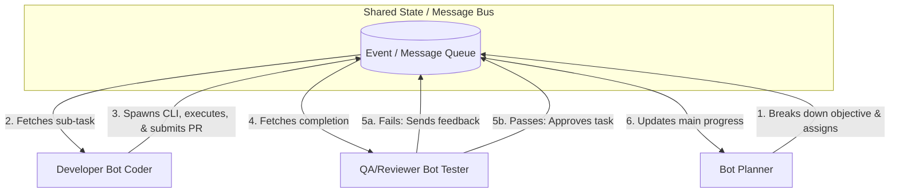
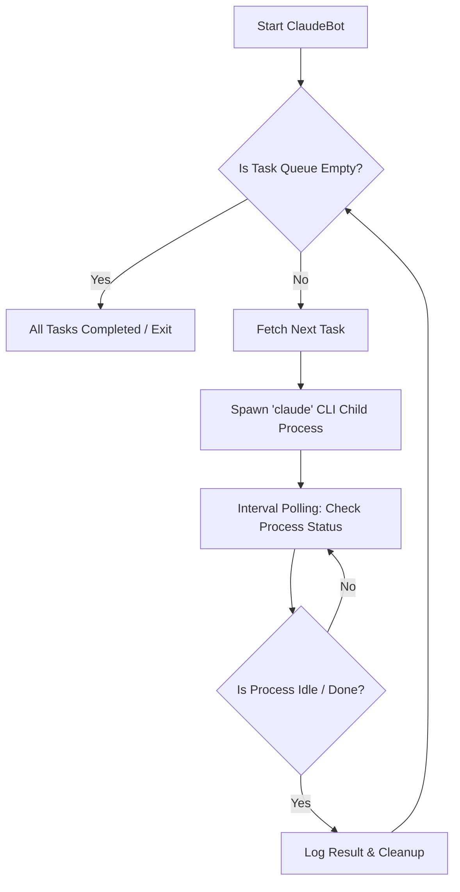

# 🤖 Product Requirements Document (PRD): ClaudeBot

## 1. Product Vision

**"Stop just chatting with AI, and start delegating."**
ClaudeBot is an autonomous, queue-driven orchestrator built on top of the official Anthropic `claude` CLI. It transforms Claude from a conversational assistant into a proactive, goal-driven agent that works continuously in the background.

## 2. Objectives & Success Metrics

* **Primary Goal:** Automate repetitive coding, refactoring, and testing tasks without manual prompt intervention.
* **Milestone:** Achieve **5,000 GitHub Stars** to secure the Claude MAX 5-month reward.
* **Success Metric:** Zero downtime between tasks. The bot successfully empties a predefined task queue with 100% autonomy.

## 3. Target Audience

* Developers tired of babysitting AI prompts.
* Teams needing massive, multi-file refactoring or automated overnight testing.
* Open-source contributors looking for hands-free boilerplate generation.

## 4. Core Features

* **Task Queue Management:** Reads a predefined list of tasks (e.g., md file) and executes them sequentially.
* **Official CLI Wrapping:** Seamlessly integrates with the official `claude` CLI, ensuring access to the latest models and capabilities.
* **Child Process Polling:** Continuously monitors the health, state, and output of the spawned CLI process.
* **Idle Detection & Handoff:** Automatically detects when a task is completed (idle state), cleans up, logs the result, and immediately starts the next task.
* **Resilient Execution:** Gracefully handles timeouts or crashes from the CLI, ensuring the loop continues until the queue is empty.

## 5. Advanced Feature: Multi-Agent Swarm (Bot-to-Bot Communication)

ClaudeBot isn't just a lone worker—it's a collaborative team. By implementing Inter-Process Communication (IPC) or a shared message broker, multiple ClaudeBots can interact, delegate, and review each other's work autonomously.

* **Role-Based Agents:** Assign distinct personas to different bots (e.g., `Manager`, `Developer`, `QA/Reviewer`).
* **Task Delegation:** A Manager bot can break down a massive objective into smaller chunks and distribute them to the Worker queues.
* **Peer Review Loop:** A Developer bot submits completed code to a QA bot. If the QA bot finds errors or test failures, it pushes the task back to the Developer bot's queue with feedback—all without human intervention.
* **Shared Context:** Bots communicate via a lightweight shared memory state (e.g., local SQLite, Redis, or simply a shared `.json` event bus), ensuring everyone is on the same page.

## 6. Multi-Agent Architecture & Workflow

The swarm architecture allows seamless handover and iterative refinement of tasks.

## 7. System Architecture & Workflow

The core engine relies on a relentless execution loop that manages the `claude` CLI as a child process.

