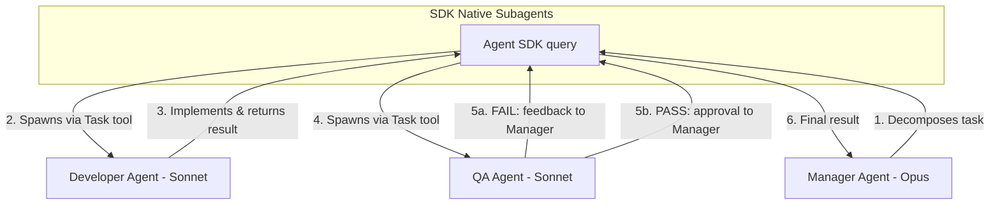
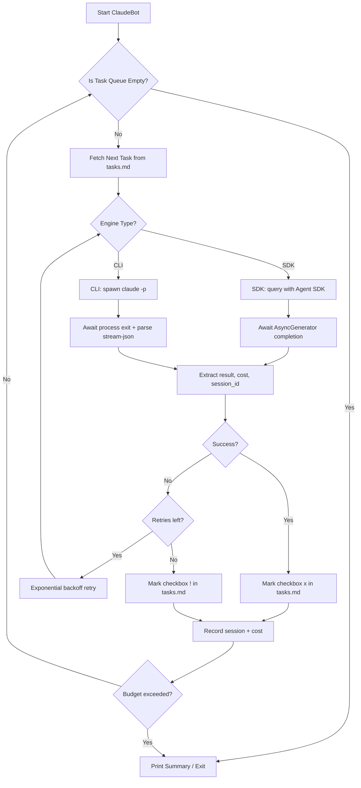
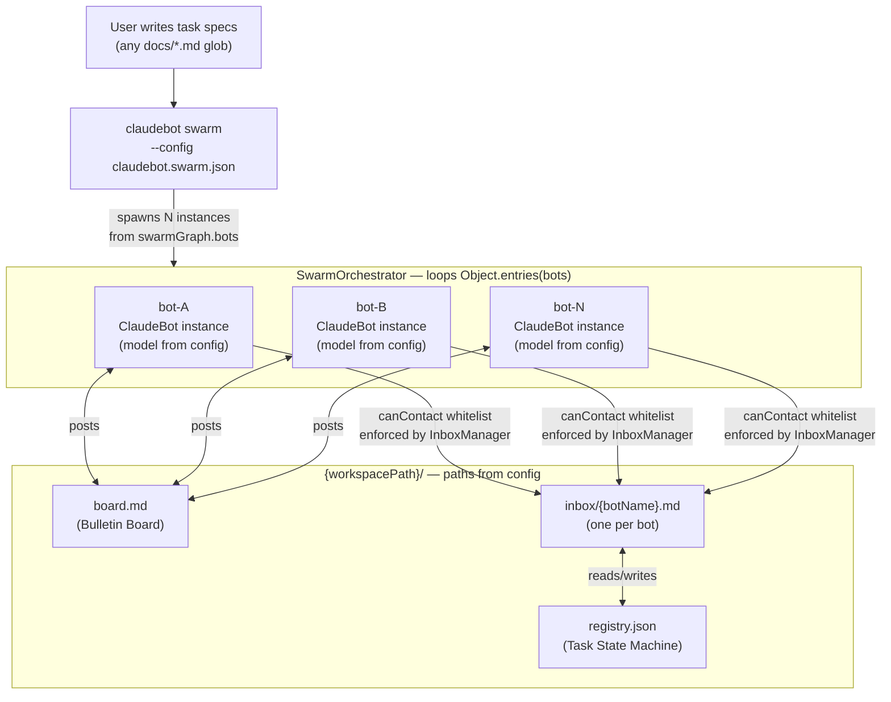

# 제품 요구사항 문서 (PRD): ClaudeBot

## 1. 제품 비전

> "AI와 대화만 하지 말고, 실제로 위임하세요."

ClaudeBot은 자율적인 큐 기반 오케스트레이터로, Claude를 단순한 대화형 보조 도구에서 백그라운드에서 지속적으로 목표를 향해 움직이는 능동적인 에이전트로 변환합니다.

**하이브리드 아키텍처:** Agent SDK (기본) + CLI 래핑 (폴백)

- **Agent SDK 엔진** (`@anthropic-ai/claude-agent-sdk`): 타입 안전성, 네이티브 서브에이전트 지원, 정확한 비용 추적. API Key 필요.
- **CLI 엔진** (`claude -p --output-format stream-json`): Max 구독 청구 방식에서 동작. 더 단순하지만 신뢰성은 낮음.

## 2. 목표 및 성공 지표

* **주요 목표:** 수동 프롬프트 개입 없이 반복적인 코딩, 리팩터링, 테스트 작업을 자동화한다.
* **마일스톤:** Claude MAX 5개월 보상을 받기 위해 **GitHub Stars 5,000개** 달성.
* **성공 지표:** 작업 간 다운타임 제로. 봇이 사전에 정의된 작업 큐를 100% 자율적으로 완전히 처리한다.

## 3. 대상 사용자

* AI 프롬프트를 일일이 관리하는 데 지친 개발자.
* 대규모 멀티 파일 리팩터링이나 야간 자동 테스트가 필요한 팀.
* 핸즈프리로 보일러플레이트를 생성하고 싶은 오픈소스 기여자.

## 4. 핵심 기능

* **작업 큐 관리:** 마크다운 파일(`tasks.md`의 체크박스)에서 작업을 읽어 순차적으로 실행한다. 인라인 태그 지원: `[cwd:path]`, `[budget:1.50]`, `[turns:30]`, `[agent:name]`.
* **하이브리드 실행 엔진:** 두 가지 구현체를 가진 추상 `IExecutor` 인터페이스:
  - **SDK Executor:** 타입 안전 스트리밍 실행과 네이티브 서브에이전트 지원을 위해 `@anthropic-ai/claude-agent-sdk`의 `query()`를 사용.
  - **CLI Executor:** Max 구독 사용자를 위해 `claude -p --output-format stream-json`을 자식 프로세스로 실행.
* **자동 완료 감지:** SDK 엔진은 `query()` 완료 시 반환. CLI 엔진은 프로세스 종료 코드 + stream-json 출력의 `type: "result"`로 완료를 감지.
* **안정적인 실행:** 지수 백오프 재시도, 작업별 AbortController 타임아웃, SIGINT/SIGTERM 우아한 종료 처리.
* **비용 추적:** SDK는 `total_cost_usd`를 정확하게 제공. CLI는 추정 비용을 제공. 전역 예산 한도를 초과하면 큐를 자동으로 중단.
* **세션 관리:** 재개 기능 및 히스토리 비용 추적을 위해 세션 ID를 `.claudebot/sessions.json`에 저장.

## 5. 고급 기능: 멀티 에이전트 스웜

ClaudeBot은 Agent SDK의 **네이티브 `agents` 옵션**을 활용한 Manager/Developer/QA 파이프라인을 지원한다. Redis, SQLite 같은 외부 메시지 브로커는 필요 없다.

* **역할 기반 에이전트:** Manager (Opus), Developer (Sonnet), QA (Sonnet)가 각각 별도의 도구 권한을 가짐.
* **작업 위임:** Manager가 SDK의 `Task` 도구를 사용해 Developer와 QA 서브에이전트를 자동으로 생성.
* **피어 리뷰 루프:** Developer가 코드를 제출하면 QA가 검증. QA 실패 시, Manager가 피드백을 Developer에게 다시 전달 (최대 3회 수정 사이클).
* **도구 격리:** QA는 읽기 전용 접근권한을 가짐 (Write/Edit 도구 없음). 무단 수정을 방지.

## 6. 멀티 에이전트 아키텍처

스웜은 SDK 네이티브 서브에이전트를 사용하므로 별도의 IPC 구현이 필요 없다.



## 7. 시스템 아키텍처

핵심 엔진은 단순한 순차 루프를 사용한다. `IExecutor` 추상화를 통해 SDK와 CLI 백엔드를 전환할 수 있다.



## 8. 기술 스택

| 구성 요소 | 기술 |
|-----------|-----------|
| 언어 | TypeScript (ESM, ES2022) |
| 기본 엔진 | `@anthropic-ai/claude-agent-sdk` |
| 폴백 엔진 | `claude` CLI (`-p --output-format stream-json`) |
| CLI 프레임워크 | Commander.js |
| 로깅 | Pino |
| config 유효성 검사 | Zod |
| 권한 모드 | `acceptEdits` (기본값) |

## 9. 비용 모델

| 엔진 | 청구 방식 | 비용 추적 |
|--------|---------|--------------|
| SDK | API Key (토큰 단위) | 정확: `SDKResultMessage.total_cost_usd` |
| CLI | Max 구독 (정액제) | 사용량 데이터 기반 추정 또는 N/A |

**예산 제어:**

- `maxBudgetPerTaskUsd`: 작업당 지출 한도
- `maxTotalBudgetUsd`: 전체 큐 실행의 전역 예산
- 예산 초과 시 큐가 자동으로 중단됨

---

## 10. BotGraph — 범용 멀티 봇 협업 파이프라인

> **상태:** 계획된 기능 (Phase 2)
> 설계일: 2026-02-28. N개 봇 자율 파이프라인을 위한 config 기반, 도메인 독립적 프레임워크.

### 10.1 비전 및 동기

현재 ClaudeBot은 단일 오케스트레이터로 작업을 순차 처리한다. 다음 진화 단계는 **BotGraph**로, 이름이 정의된 봇들이 각자의 역할, 도구 권한, 피어 연결을 선언하고 공유 파일 워크스페이스를 통해 협력하여 작업 백로그를 소진할 때까지 동작하는 구성 가능한 팀이다.

**핵심 원칙:** 프레임워크는 도메인에 독립적이다. 동일한 런타임이 소프트웨어 개발 팀, 연구 팀, 콘텐츠 파이프라인, 또는 어떤 협업 워크플로우도 지원한다 — `claudebot.swarm.json`을 바꾸는 것만으로 가능하며, 코드 변경은 필요 없다.

**핵심 아이디어:** N개의 이름이 붙은 Claude 인스턴스가 watch 모드로 독립적인 ClaudeBot 프로세스로 동작한다. 이들은 공유 게시판(`board.md`)과 봇별 inbox라는 두 개의 파일 기반 채널로 통신한다. 외부 메시지 브로커(Redis, RabbitMQ)는 필요 없다 — 파일 I/O가 메시지 버스 역할을 한다.

**기존 SDK 스웜과의 관계:** SDK 네이티브 스웜(5절)은 단일 `query()` 호출 내에서 동작한다 — 하향식, 일회성, 프로세스 간 상태 없음. BotGraph는 여러 프로세스에 걸쳐 영속 상태로 실행된다. 둘은 상호 보완적이다: BotGraph의 봇은 내부적으로 복잡한 서브태스크 처리를 위해 SDK 스웜을 활용할 수 있다.

---

### 10.2 BotGraph Config 스키마 (`claudebot.swarm.json`)

모든 봇 역할, 연결, 동작은 단일 config 파일에 선언된다. 프레임워크가 이를 읽어 적절한 프로세스를 생성한다 — 코드 어디에도 봇 이름이 하드코딩되지 않는다.

```jsonc
{
  "engine": "sdk",
  "permissionMode": "acceptEdits",
  "maxTotalBudgetUsd": 50.00,
  "watchIntervalMs": 15000,

  "swarmGraph": {
    // 공유 워크스페이스 경로 (설정 가능, 하드코딩 아님)
    "workspacePath": ".botspace",
    "boardFile": "board.md",
    "registryFile": "registry.json",
    "stuckTaskTimeoutMs": 600000,

    // 실행 시 파이프라인을 시작하는 봇 (나머지는 inbox 메시지로 깨어남)
    "entryBots": ["coordinator"],

    // N개 봇 — 이름과 역할은 자유롭게 설정
    "bots": {
      "coordinator": {
        "model": "claude-opus-4-6",
        "systemPromptFile": "prompts/coordinator.md",  // 또는 인라인 "systemPrompt"
        "watchesFiles": ["docs/tasks/*.md"],            // 이 봇의 트리거 파일 (glob)
        "canContact": ["worker", "reviewer"],           // 화이트리스트 — 오케스트레이터가 강제
        "workspaceDir": "coordinator",                  // workspacePath 하위 경로
        "maxBudgetPerTaskUsd": 5.00,
        "maxTurnsPerTask": 30,
        "terminatesOnEmpty": true,                      // 완료 시 SWARM_COMPLETE 게시
        "allowedTools": ["Read", "Write", "Edit", "Grep", "Glob"]
      },
      "worker": {
        "model": "claude-sonnet-4-6",
        "systemPromptFile": "prompts/worker.md",
        "watchesFiles": [],                             // inbox 메시지로만 깨어남
        "canContact": ["coordinator", "reviewer"],
        "workspaceDir": "worker",
        "maxBudgetPerTaskUsd": 10.00,
        "maxTurnsPerTask": 60,
        "terminatesOnEmpty": false,
        "allowedTools": ["Read", "Write", "Edit", "Grep", "Glob", "Bash"]
      },
      "reviewer": {
        "model": "claude-sonnet-4-6",
        "systemPromptFile": "prompts/reviewer.md",
        "watchesFiles": [],
        "canContact": ["coordinator", "worker"],
        "workspaceDir": "reviewer",
        "maxBudgetPerTaskUsd": 3.00,
        "maxTurnsPerTask": 20,
        "terminatesOnEmpty": false,
        "allowedTools": ["Read", "Grep", "Glob", "Bash"]  // Write/Edit 없음 = 읽기 전용
      }
    },

    "message": {
      "routingStrategy": "explicit",   // canContact 강제; LLM이 화이트리스트에서 수신자 선택
      "format": "envelope",
      "maxRoutingCycles": 3            // 최대 수정 사이클 수, 초과 시 failed로 전환
    },
    "termination": {
      "gracePeriodMs": 30000
    }
  }
}
```

**하드코딩된 PRD 개념을 대체하는 핵심 config 필드:**

| 기존 (하드코딩) | 변경 후 (config 필드) |
| --- | --- |
| 고정된 봇 이름 | `bots: Record<string, BotDefinition>` — 임의의 문자열 키 |
| `.botspace/` 경로 | `swarmGraph.workspacePath` |
| `bot-pd`가 진입점으로 하드코딩 | `entryBots: string[]` — 임의의 봇 지정 가능 |
| `bot-pd`가 종료자로 하드코딩 | `terminatesOnEmpty: boolean` (봇별 설정) |
| 암묵적인 `canContact` | `canContact: string[]` (봇별 화이트리스트) |
| 타입이 정해진 메시지 열거형 | 봉투의 자유 형식 `subject` 문자열 |
| `bot-pd`의 `docs/task*.md` 하드코딩 | `watchesFiles: string[]` (봇별 glob) |
| `bot-configs.ts`의 시스템 프롬프트 | `systemPrompt` 인라인 또는 `systemPromptFile` 경로 |

---

### 10.3 범용 메시지 봉투 (Generic Message Envelope)

모든 봇 간 메시지는 각 봇의 inbox에 마크다운 체크박스로 작성되는 단일 봉투 형식을 사용한다 — **코드 변경 없이 기존 `parseTasks` 정규식으로 파싱된다:**

```markdown
# .botspace/inbox/worker.md

- [ ] MSG-042 | from:coordinator | to:worker | subject:ASSIGN | taskId:task-001 | See docs/tasks/task-001.md
- [ ] MSG-043 | from:reviewer | to:worker | subject:REWORK | taskId:task-001 | See .botspace/reviewer/task-001-r1.md
- [x] MSG-041 | from:coordinator | to:worker | subject:ASSIGN | taskId:task-000 | Initial impl task
```

| 필드 | 타입 | 설명 |
| --- | --- | --- |
| `MSG-NNN` | 자동 증가 | 고유 메시지 ID |
| `from` | 봇 이름 | 발신자 (`canContact` 대조 검증) |
| `to` | 봇 이름 | 수신자 |
| `subject` | 자유 문자열 | 의미 레이블 — **열거형 없음**, 프롬프트에서 도메인 정의 |
| `taskId` | string? | 선택적 registry 참조 |
| 뒤따르는 텍스트 | 자유 문자열 | 사람이 읽기 위한 컨텍스트 또는 파일 경로 |

**`subject`는 자유 형식:** `ASSIGN`, `REWORK`, `QUESTION`, `COPY_READY`, `TESTS_FAILED` — 어휘는 코드가 아닌 `prompts/*.md` 파일에서 정의된다. 워크플로우 어휘를 바꾸려면 프롬프트만 수정하면 된다.

**inbox를 작업 큐로 활용:** 각 봇의 ClaudeBot 인스턴스는 inbox 파일을 `tasksFile`로 사용한다. 읽지 않은 메시지(`[ ]`)는 작업이 되고, 처리된 메시지는 `[x]`가 된다. 기존 `parseTasks` + `updateTaskInFile` 로직이 이를 자동으로 처리한다.

---

### 10.4 통신 채널

두 채널이 동시에 동작한다:

#### 채널 A: 공유 게시판 — `{workspacePath}/board.md`

모든 봇이 볼 수 있는 **공개, 추가 전용** 마크다운 로그. 감사 추적과 브로드캐스트를 위해 모든 주요 행동이 여기에 기록된다.

```markdown
## 2026-02-28T14:00:00Z | coordinator | ASSIGN
Delegating task-001 "Implement JWT auth" to worker.

## 2026-02-28T14:22:10Z | worker | QUESTION
@coordinator: Should JWT use RS256 or HS256?

## 2026-02-28T14:23:00Z | coordinator | ANSWER
@worker: Use RS256. See config/security.md.

## 2026-02-28T15:46:00Z | coordinator | COMPLETE
task-001 marked [x]. Picking up task-002.
```

#### 채널 B: 직접 inbox — `{workspacePath}/inbox/{botName}.md`

봇별 inbox 파일 (위의 봉투 형식 참고). 오케스트레이터는 쓰기 전에 `canContact`를 강제 적용한다 — 허가받지 않은 봇에게 보내는 메시지는 거부되고 `board.md`에 기록된다.

---

### 10.5 작업 상태 머신

`{workspacePath}/registry.json`에서 추적하는 범용 상태 — 봇 이름이나 도메인에 관계없이 동일한 상태 이름을 사용:

```text
pending ──► assigned ──► in_progress ──► reviewing ──► done
                │              │               │
                │           paused ────────────┘  (clarification 대기 중)
                │                               │
                └───────────────────────────────► failed
                        (maxRoutingCycles 초과)
```

| 상태 | 설정 주체 | 트리거 |
| --- | --- | --- |
| `pending` | entry bot | `watchesFiles`에서 작업 발견 |
| `assigned` | entry bot | worker에게 작업 메시지 전송 |
| `in_progress` | worker | worker가 작업 수락 확인 |
| `paused` | worker | worker가 coordinator에게 QUESTION 전송 |
| `reviewing` | worker | worker가 reviewer에게 READY_FOR_REVIEW 전송 |
| `done` | reviewer | reviewer가 coordinator에게 APPROVED 전송 |
| `failed` | reviewer / coordinator | `maxRoutingCycles` 초과 |

상태 이름은 범용적이다 — 도메인(소프트웨어, 연구, 데이터, 콘텐츠)에 관계없이 동일한 상태를 사용한다.

---

### 10.6 워크스페이스 파일 구조

워크스페이스 레이아웃은 config에서 파생된다 — 하드코딩된 경로 없음:

```text
{workspacePath}/                  # swarmGraph.workspacePath로 설정 가능
├── board.md                      # 공유 게시판 (추가 전용)
├── registry.json                 # 작업 상태 머신 (정규 소스)
├── inbox/
│   ├── {botName-1}.md            # botName-1에게 보내는 직접 메시지
│   ├── {botName-2}.md            # botName-2에게 보내는 직접 메시지
│   └── {botName-N}.md            # config에 선언된 봇별 inbox 1개
└── {botName}/                    # 봇별 워크스페이스 (봇당 디렉터리 1개)
    └── sessions.json             # 봇별 비용/세션 히스토리
```

프롬프트 파일은 사용자 정의 위치에 `workspacePath` 외부에 위치한다:

```text
prompts/
├── coordinator.md                # coordinator 봇의 시스템 프롬프트
├── worker.md                     # worker 봇의 시스템 프롬프트
└── reviewer.md                   # reviewer 봇의 시스템 프롬프트
```

---

### 10.7 새로운 컴포넌트 (`src/swarm/`)

모든 컴포넌트는 완전히 범용적이다 — **어디에도 봇 이름이 하드코딩되지 않는다:**

| 파일 | 설명 |
| --- | --- |
| `types.ts` | `BotDefinition`, `SwarmGraphConfig` (Zod 스키마), `BotMessage`, `RegistryEntry` |
| `config-loader.ts` | `loadSwarmConfig()` — `claudebot.swarm.json` 유효성 검사 |
| `bot-factory.ts` | `buildBotConfig(botName, def, root)` → `ClaudeBotConfig` — `BotDefinition`으로부터 봇별 config 파생 |
| `orchestrator.ts` | `SwarmOrchestrator` — `Object.entries(config.swarmGraph.bots)`를 순회하며 N개의 `ClaudeBot` 인스턴스 생성 |
| `inbox.ts` | `InboxManager` — inbox 파일 읽기/쓰기, `canContact` 화이트리스트 강제 |
| `board.ts` | `BulletinBoard` — `board.md`에 타임스탬프 항목 추가 |
| `registry.ts` | `RegistryManager` — `registry.json` 원자적 읽기/쓰기 |
| `workspace.ts` | `bootstrapWorkspace()` — 최초 실행 시 config 기반으로 디렉터리 생성 |

**기존 컴포넌트는 변경 없음:** `ClaudeBot`, `parseTasks`, `updateTaskInFile`, `SdkExecutor`, `SessionManager`. 봇 간 차별화는 전적으로 `systemPromptPrefix` + `allowedTools` + `tasksFile`에서 오며, 이 모두는 `bot-factory.ts`의 `BotDefinition`에서 파생된다.

**오케스트레이터 핵심 (범용, 이름 하드코딩 없음):**

```typescript
// src/swarm/orchestrator.ts
const instances = Object.entries(config.swarmGraph.bots).map(([name, def]) => ({
  name,
  bot: new ClaudeBot(buildBotConfig(name, def, config), logger),
}));
await Promise.all(instances.map(({ bot }) => bot.run()));
```

---

### 10.8 다양한 팀 구성 (동일한 런타임, 다른 config)

동일한 `SwarmOrchestrator` 코드가 코드 변경 없이 아래 모든 구성을 실행한다 — `claudebot.swarm.json`만 다르다:

| 팀 유형 | 진입 봇 | 봇 구성 | `watchesFiles` | `terminatesOnEmpty` |
| --- | --- | --- | --- | --- |
| 소프트웨어 개발 | `coordinator` | coordinator, worker, reviewer | `docs/tasks/*.md` | coordinator |
| 연구 | `lead` | lead, researcher, writer, editor | `docs/briefs/*.md` | lead |
| 데이터 파이프라인 | `planner` | planner, coder, tester | `docs/pipelines/*.md` | planner |
| 콘텐츠 마케팅 | `strategist` | strategist, copywriter, seo | `docs/requests/*.md` | strategist |

**원래 설계의 PD/Dev/QA 시나리오는 다음과 같이 표현된다:**
`coordinator` (Opus, `terminatesOnEmpty: true`, `watchesFiles: ["docs/task*.md"]`) + `worker` (Sonnet, 전체 도구) + `reviewer` (Sonnet, 읽기 전용 도구). 동일한 동작, 범용 이름.

---

### 10.9 아키텍처 다이어그램



---

### 10.10 설계 결정 사항

**왜 타입이 정해진 열거형 대신 자유 형식 `subject`를 사용하는가?**
열거형(`TASK_ASSIGNMENT`, `IMPL_COMPLETE` 등)은 특정 도메인에 속하며, 다른 워크플로우(`COPY_READY`, `TESTS_FAILED`, `RESEARCH_DONE`)에서는 즉시 맞지 않게 된다. 오케스트레이터는 `subject`를 해석하지 않는다 — 봉투를 라우팅할 뿐이다. subject의 의미는 `prompts/*.md`에 있으며, 코드 수정 없이 어휘를 바꿀 수 있다.

**왜 자율적인 LLM 라우팅 대신 `canContact` 화이트리스트(명시적 라우팅)를 사용하는가?**
명시적 엣지는 감사 가능하고(`board.md`에 모든 라우팅 결정이 기록됨), 조용한 실패를 방지하며, 설계에서 예측하지 못한 사이클이 봇 간에 형성되는 것을 막는다. LLM은 여전히 언제 연락할지, 허가된 연락처 중 누구를 선택할지 결정한다 — 다만 선언된 화이트리스트 밖으로는 라우팅할 수 없다.

**왜 SDK 네이티브 스웜 대신 멀티 프로세스를 사용하는가?**
SDK 스웜은 단일 `query()` 호출 내에서 실행된다 — 하향식만 가능, 측면 통신 없음, 실행 간 상태 손실. BotGraph는 양방향 메시징(clarification을 위한 worker → coordinator), 멀티 작업 수명주기 추적, 재시작 후에도 살아남는 상태를 필요로 한다. 단일 복잡 작업 분해에는 SDK 스웜을, 영속적인 멀티 작업 파이프라인에는 BotGraph를 사용한다.

**동시성과 파일 안전성:**
N개의 봇이 `registry.json`에 동시에 쓸 수 있다. 대응책: 타임아웃이 있는 `.registry.lock` 센티넬 파일이 동시 덮어쓰기를 방지한다. `board.md`는 추가 전용으로, 동시 추가 시 최악의 경우 줄이 섞일 수 있으나 데이터 손상은 없다.

**루프 종료:**
`terminatesOnEmpty: true`로 설정된 봇이 `watchesFiles`를 모니터링한다. registry의 모든 작업이 `done`/`failed` 상태이고 미체크 작업이 남지 않으면, `board.md`에 `SWARM_COMPLETE`를 게시한다. 오케스트레이터가 이 신호를 감지하고 `gracePeriodMs` 후 모든 인스턴스에 `bot.abort()`를 호출한다.

---

### 10.11 구현 로드맵

| 단계 | 산출물 | 우선순위 |
| --- | --- | --- |
| Phase 2.1 | `src/swarm/types.ts` — `BotDefinition`, `SwarmGraphConfig`, `BotMessage`, `RegistryEntry`에 대한 Zod 스키마 | 높음 |
| Phase 2.2 | `src/swarm/config-loader.ts` + `bot-factory.ts` — config 유효성 검사 및 봇별 config 파생 | 높음 |
| Phase 2.3 | `src/swarm/inbox.ts` + `board.ts` + `registry.ts` + `workspace.ts` — 통신 데이터 계층 | 높음 |
| Phase 2.4 | `src/swarm/orchestrator.ts` — 종료 감지 기능이 포함된 범용 N봇 스포너 | 높음 |
| Phase 2.5 | `src/index.ts`의 `claudebot swarm` CLI 명령어 | 중간 |
| Phase 2.6 | 소프트웨어 개발 팀을 위한 예시 `claudebot.swarm.json` + `prompts/` | 중간 |
| Phase 2.7 | 오케스트레이터의 데드락 감지 + stuck-task 감시 | 낮음 |
| Phase 2.8 | `claudebot status --swarm`의 봇 간 비용 집계 | 낮음 |
